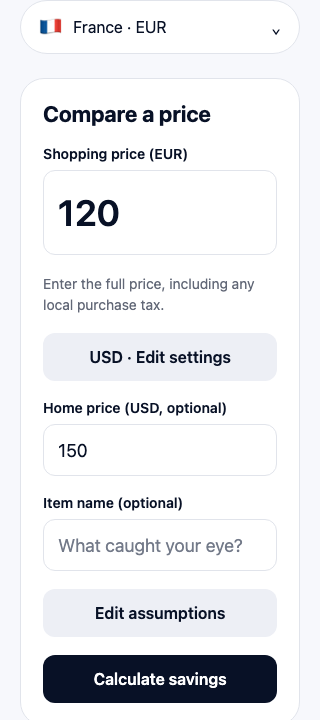
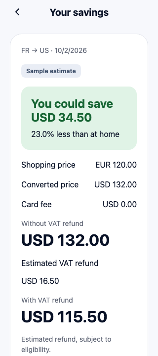

# Prototype verification

The calculator foundation and interactive sample prototype are implemented. Compare and Result are two sections of one scrolling screen, so input edits and results stay together. This is a prototype with mocked reference data and illustrative refund assumptions, not production FX or verified refund eligibility.

## Demonstrate it

Run `npm start` on a configured Android/iOS environment, or `npm run web` for a browser preview without an Android SDK. Tap **Get started** on the welcome screen; **Sign in** is disabled. On first use, select **United States** as the country of residence explicitly. With shopping country **France**, home currency **USD**, price **120**, and home price **150**, the result should show:

- Without VAT refund: **USD 132.00**.
- Estimated refund: **USD 16.50**.
- With VAT refund: **USD 115.50**.
- Potential savings: **USD 34.50 (23.0%)**.

Use **Edit assumptions** to enter a 3% bank fee; the net cost becomes USD 119.46. A EUR 21 manual refund produces a validation error. **Reset FX and refund to automatic** clears only comparison overrides, retaining the bank-fee preference. Changing shopping country, home currency, residency, or shopping price clears comparison overrides. Country/residency, home currency, and valid bank fees persist; item details and comparison overrides do not.

Sample country/currency options include France/EUR, US/USD, Japan/JPY, UK/GBP, and Australia/AUD. Membership still comes from the reference snapshot, so an existing fresh cache gains new fixture countries at its next refresh. The one illustrative automatic refund rule covers general goods in France for US residents. Other combinations display refund unavailable unless a manual amount is supplied. Residency choices remain independent of shopping-country support.

## Checks actually run

- `npm run typecheck`: app and test TypeScript passed.
- `npm test`: 68 domain/data/integration tests passed.
- `npm run check:dependencies`: Expo dependency versions passed.
- `NODE_ENV=production npm run export:mobile`: Android and iOS JavaScript bundles passed.
- `NODE_ENV=production npm run export:web`: browser production bundle passed.
- `PLAYWRIGHT_BROWSERS_PATH=/tmp/savly-playwright npm run test:ui`: nine Chromium browser tests passed against the production web export.

The browser tests verify welcome-to-Compare navigation, disabled Sign in, and the automatic numerical example, fee edits, refund validation, settings after reload, override reset, missing/equal/unfavorable comparisons, stale-cache recovery, missing FX, unavailable refunds, sharing payload/cancellation with a simulated browser share API, and a 320-pixel layout without horizontal overflow. API/cache failures also have fake-clock and transport tests. Stale browser recovery uses a simulated storage-write failure; it is not a deployed-backend outage test.

Startup compatibility regression: country selectors were reproduced failing when `Intl.DisplayNames` was undefined. They now use bundled English names when it is missing or a locale is unsupported. Unit tests cover this fallback and a browser test opens the app and verifies the AC12 calculation with `Intl.DisplayNames`, `Intl.Locale`, and `Intl.supportedValuesOf` disabled. The same regression now also disables `NumberFormat.formatToParts`, covering settings hydration and decimal parsing. Decimal separators fall back to the basic number formatter, preserving comma-decimal locales. A separate browser regression injects an asynchronous initialization error and verifies the error/Retry screen recovers with no unhandled promise rejection. This is simulated engine coverage, not a native device run.

Welcome screenshot from the 390-pixel browser preview, visually reviewed:

Screenshots from the 320-pixel browser preview, visually reviewed:

## Device and release checks still needed

Android/iOS physical devices and simulators were not run. Verify native storage across restarts, AppState expiry/recovery, keyboards, screen readers, large text settings, and native share-sheet cancellation/errors on both platforms. Verify received text/link behavior in WhatsApp and another destination; the app never reports recipient delivery.

The configured share link defaults to the clearly labeled `https://example.com/app` demonstration address. It does not download or open Savly. A local demo landing page is at `public/app/index.html` (served at `/app/` in the web export). Supply an owned HTTPS `/app` URL via `EXPO_PUBLIC_SAVLY_APP_LINK`, then implement and verify association files and real store destinations before release. No page was published or backend deployed during this work.
