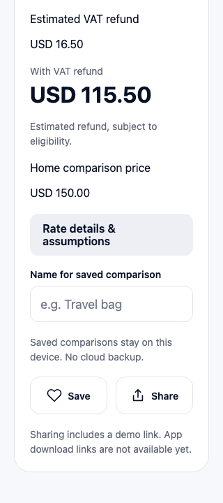

# Prototype verification

The calculator foundation and interactive sample prototype are implemented. Compare and Result are separate pages. Calculate savings opens the submitted result; Back preserves form entries. Save stores a named snapshot locally, and Saved comparisons lets users reopen or delete it. This is a prototype with mocked reference data and illustrative refund assumptions, not production FX or verified refund eligibility.

Navigation update (2026-10-02): the shopping-country dropdown appears above Calculate, Scan, and Saved. Tab switches retain the draft. Scan is a coming-soon placeholder. The fixed Your Savings header has a back arrow returning to Calculate.

## Demonstrate it

Run `npm start` on a configured Android/iOS environment, or `npm run web` for a browser preview without an Android SDK. Tap **Get started** on the welcome screen; **Sign in** is disabled. On first use, select **United States** as the country of residence explicitly. Home currency becomes **USD** automatically. With shopping country **France**, price **120**, and home price **150**, tap **Calculate savings**. The result should show:

- Without VAT refund: **USD 132.00**.
- Estimated refund: **USD 16.50**.
- With VAT refund: **USD 115.50**.
- Potential savings: **USD 34.50 (23.0%)**.

Use **Back to calculator**, then **Edit assumptions** to enter a 3% bank fee; tap Calculate savings again to see a net cost of USD 119.46. A EUR 21 manual refund produces a validation error. **Reset FX and refund to automatic** clears only comparison overrides, retaining the bank-fee preference. Changing shopping country, residency, or shopping price clears comparison overrides. Changing the automatically derived home currency also clears the home price. Saved legacy currency choices are reconciled on startup; missing country/currency metadata blocks totals with an explanation. Country/residency, home currency, and valid bank fees persist; item details and comparison overrides do not.

Sample country/currency options include Spain/EUR, France/EUR, US/USD, Japan/JPY, UK/GBP, and Australia/AUD. Membership still comes from the reference snapshot, so an existing fresh cache gains new fixture countries at its next refresh. Illustrative automatic refund rules cover general goods in France and Spain for US residents; Spain assumes full included VAT before an assumed 28% provider fee. Other combinations display refund unavailable unless a manual amount is supplied. Residency choices remain independent of shopping-country support.

The [AC19 Spain worked example](../specs/001-shopping-calculator/spain-worked-example.md) is verified in domain/model, persistence, sharing, and browser tests using an injected stale quote of USDEUR 0.8887. The ordinary prototype FX fixture is unchanged.

## Checks actually run

- `npm run typecheck`: app and test TypeScript passed.
- `npm test`: 77 domain/data/integration/storage tests passed.
- `npm run check:dependencies`: Expo dependency versions passed.
- `NODE_ENV=production npm run export:mobile`: Android and iOS JavaScript bundles passed.
- `NODE_ENV=production npm run export:web`: browser production bundle passed.
- `PLAYWRIGHT_BROWSERS_PATH=/tmp/savly-playwright npm run test:ui`: fourteen Chromium browser tests passed against the production web export.

The browser tests verify submission-only result navigation, Back/form preservation, Save/reopen/delete after reload, save failure handling, welcome-to-Compare navigation, disabled Sign in, and the automatic numerical example, fee edits, refund validation, settings after reload, override reset, missing/equal/unfavorable comparisons, stale-cache recovery, missing FX, unavailable refunds, sharing payload/cancellation with a simulated browser share API, and a 320-pixel layout without horizontal overflow. API/cache failures also have fake-clock and transport tests. Stale browser recovery uses a simulated storage-write failure; it is not a deployed-backend outage test.

Startup compatibility regression: country selectors were reproduced failing when `Intl.DisplayNames` was undefined. They now use bundled English names when it is missing or a locale is unsupported. Unit tests cover this fallback and a browser test opens the app and verifies the AC12 calculation with `Intl.DisplayNames`, `Intl.Locale`, and `Intl.supportedValuesOf` disabled. The same regression now also disables `NumberFormat.formatToParts`, covering settings hydration and decimal parsing. Decimal separators fall back to the basic number formatter, preserving comma-decimal locales. A separate browser regression injects an asynchronous initialization error and verifies the error/Retry screen recovers with no unhandled promise rejection. This is simulated engine coverage, not a native device run.

Welcome screenshot from the 390-pixel browser preview, visually reviewed:

Screenshots from the 320-pixel browser preview, visually reviewed:

Save/Share styling follow-up: four targeted browser checks (sharing, small-screen layout, saving/reopening, and save failures), TypeScript, and Android/iOS/web exports passed. Outlined icon buttons were visually reviewed at 320 pixels.

## Device and release checks still needed

Android/iOS physical devices and simulators were not run. Verify native storage across restarts, AppState expiry/recovery, keyboards, screen readers, large text settings, and native share-sheet cancellation/errors on both platforms. Verify received text/link behavior in WhatsApp and another destination; the app never reports recipient delivery.

The configured share link defaults to the clearly labeled `https://example.com/app` demonstration address. It does not download or open Savly. A local demo landing page is at `public/app/index.html` (served at `/app/` in the web export). Supply an owned HTTPS `/app` URL via `EXPO_PUBLIC_SAVLY_APP_LINK`, then implement and verify association files and real store destinations before release. No page was published or backend deployed during this work.
